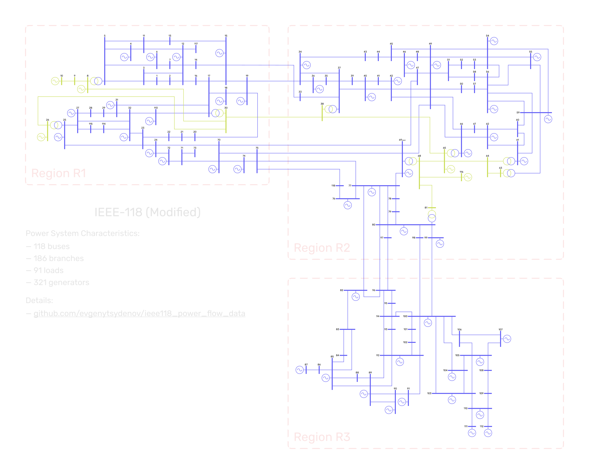

[python]: https://www.python.org/downloads/release/python-3100/
[python-shield]: https://img.shields.io/badge/python-3.10-blue.svg
[license]: http://creativecommons.org/licenses/by-nc-sa/4.0/
[license-shield]: https://img.shields.io/badge/License-CC%20BY--NC--SA%204.0-lightgrey.svg


[![CC-BY-NC-SA-4.0][license-shield]][license]
[![Python 3.10][python-shield]][python]


# Power Flow Data of IEEE-118 Bus System


The repository contains a data pipeline to build power flow cases of an IEEE-118 like power system with an hourly frequency for one year.

The system consists of 118 buses, 186 branches (177 lines, 9 transformers), 91 loads, 321 generators, and looks as follows (other image formats can be found [here](resources/plot)).



The prepared power flow cases can be used in research purposes for power flow analysis, static security analysis, etc.


## Data Preparation Steps

The pipeline for data preparation and building power flow cases is separated into stages:
- parse (extract necessary parameters from the raw data)
- transform (combine and convert data to use in further steps)
- prepare (compose final dataset to create power flow cases)
- build (create power flow cases using [the PandaPower engine](http://www.pandapower.org/))

The presented pipeline processes mainly a dataset described [in the paper "An Extended IEEE 118-Bus Test System With
High Renewable Penetration"](https://ieeexplore.ieee.org/document/7904729) (aka "NREL-118"). The NREL-118 dataset contains information about a power system based on the transmission representation of the IEEE-118 test system with a lot of modifications which are analyzed [in this notebook](https://nbviewer.org/github/evgenytsydenov/ieee118_power_flow_data/blob/main/notebooks/explore_nrel118_data.ipynb). To append the data with some additional info, the information about the IEEE-118 test system prepared by Illinois Institute of Technology (version of 2004) is also used (see [the JEAS-118 dataset](http://motor.ece.iit.edu/data/JEAS_IEEE118.doc)) in the stages.

Actions performed at each stage and all the assumptions made during the preparation process are described [in this notebook](https://nbviewer.org/github/evgenytsydenov/ieee118_power_flow_data/blob/main/notebooks/prepare_power_flow_data.ipynb). The naming of variables in the prepared data corresponds [to the project convention](convention.md).

To ensure the execution order and reproducibility of the stages, [Data Version Control](https://dvc.org/) is used. The configuration of the stages can be found [in the DVC config](dvc.yaml).


## How to Use

Power system data (model structure, time-series, plots, etc.) and power flow cases built using the latest release version of the pipeline can be downloaded [from the release page](https://github.com/evgenytsydenov/ieee118_power_flow_data/releases/latest) (see, the "dataset-*.zip" archive).

To customize the pipeline or to build power flow cases manually:
1. Download the source code [from the latest release](https://github.com/evgenytsydenov/ieee118_power_flow_data/releases/latest) or [clone the repository](https://docs.github.com/en/repositories/creating-and-managing-repositories/cloning-a-repository).
2. Go to the project directory, create and activate a virtual environment, install project dependencies [with poetry](https://python-poetry.org/docs/basic-usage/#installing-dependencies) or [pip](https://packaging.python.org/en/latest/guides/installing-using-pip-and-virtual-environments/).
3. Add customizations or tune parameters that are listed [in definitions](definitions.py) and used in the computation.
4. Run `main.py` script in the activated environment. It is also possible to add the project directory to `PYTHONPATH` and run `dvc repro` in the terminal.
5. After completing all the stages, the power flow cases will be saved in the folder "samples" in the project directory.


## License and Copyright

This work is licensed under [Creative Commons Attribution-NonCommercial-ShareAlike 4.0 International License][license].


## Citation

If you use the repository code or prepared dataset (power system data, power flow cases, plots, etc.) in your research, please cite the following BibTeX entry:
```
@software{Tsydenov_Power_Flow_Data_2022,
    author = {Tsydenov, Evgeny and Prokhorov, Anton},
    license = {CC-BY-NC-SA-4.0},
    month = {11},
    title = {{Power Flow Data of IEEE-118 Bus System}},
    url = {https://github.com/evgenytsydenov/ieee118_power_flow_data},
    version = {0.0.1},
    year = {2022}
}
```
